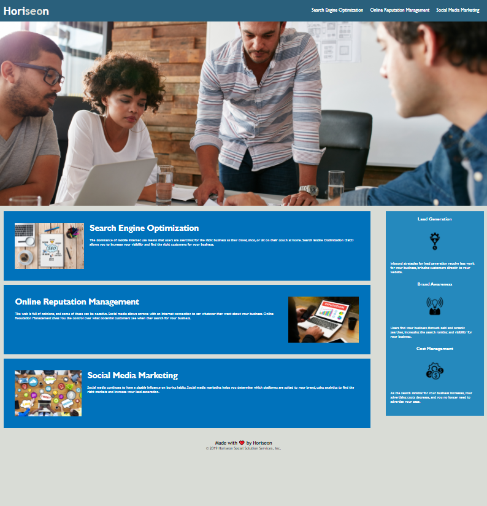

# Fist Homework assignment for UNH Full-Stack Coding Bootcamp

## Description

This goal for this assignment was to refactor the code of the original Horiseon company website to improve its accessability

## HTML 

The title has been renamed to be specific and descriptive to the company webiste 

Semantic elements have been added for accessability and optimized for search engine and screen readers

All headings are in sequential order 

The elements have been shifted so when the structure is viewed the HTML elements follow a logical stucture

An accessible ALT attribute has been added to all images

## CSS

Elements which are styled the same way have been given a class attribute to consolidate on the CSS sheet 

Specified the scrolling behavior for scolling box to give the page a smooth transition from the navigation bar to the clickable links

## Built with

* HTML
* CSS

## Links

* [GitHub Repository](https://github.com/efagioli01/horiseon-refactor)
* [Deployed Application](https://efagioli01.github.io/horiseon-refactor/)

## Screenshot 
 
 
 
 ## LICENSE

 MIT License

Copyright (c) [2021] [Erica Fagioli] 

Permission is hereby granted, free of charge, to any person obtaining a copy of this software and associated documentation files (the "Software"), to deal in the Software without restriction, including without limitation the rights to use, copy, modify, merge, publish, distribute, sublicense, and/or sell copies of the Software, and to permit persons to whom the Software is furnished to do so, subject to the following conditions:

The above copyright notice and this permission notice shall be included in all copies or substantial portions of the Software.

THE SOFTWARE IS PROVIDED "AS IS", WITHOUT WARRANTY OF ANY KIND, EXPRESS OR IMPLIED, INCLUDING BUT NOT LIMITED TO THE WARRANTIES OF MERCHANTABILITY, FITNESS FOR A PARTICULAR PURPOSE AND NONINFRINGEMENT. IN NO EVENT SHALL THE AUTHORS OR COPYRIGHT HOLDERS BE LIABLE FOR ANY CLAIM, DAMAGES OR OTHER LIABILITY, WHETHER IN AN ACTION OF CONTRACT, TORT OR OTHERWISE, ARISING FROM, OUT OF OR IN CONNECTION WITH THE SOFTWARE OR THE USE OR OTHER DEALINGS IN THE SOFTWARE.

 

